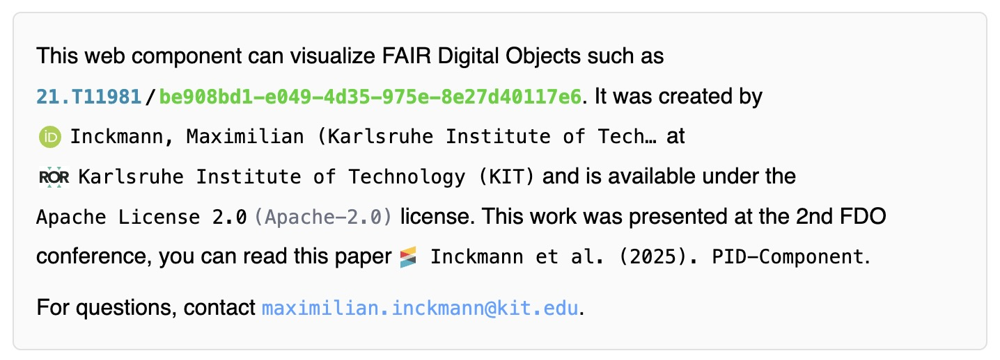

# PID Component

[](https://github.com/kit-data-manager/pid-component/actions/workflows/npm-ci.yml)
[](https://github.com/kit-data-manager/pid-component/actions/workflows/npm-ci.yml)
[](https://github.com/kit-data-manager/pid-component/actions/workflows/npm-ci.yml)
[](https://github.com/kit-data-manager/pid-component/actions/workflows/npm-ci.yml)
[](https://codecov.io/gh/kit-data-manager/pid-component)
[](https://github.com/kit-data-manager/pid-component/actions/workflows/github-code-scanning/codeql)

[](https://doi.org/10.5281/zenodo.13629109)
[](https://www.npmjs.com/package/@kit-data-manager/pid-component)
[](https://www.npmjs.com/package/@kit-data-manager/pid-component)
[](https://spdx.org/licenses/Apache-2.0)
[](https://kit-data-manager.github.io/pid-component)

The `pid-component` is an easily extensible web component that can be used to display PIDs, ORCiDs, and other
identifiers in a user-friendly way.
It is easily extensible to support other identifier types.

> Framework wrappers are available
> for [React](https://www.npmjs.com/package/@kit-data-manager/react-pid-component), [Vue](https://www.npmjs.com/package/@kit-data-manager/vue-pid-component),
> and [Angular](https://www.npmjs.com/package/@kit-data-manager/angular-pid-component).

The `pid-component` dynamically renders a component based on the value of the `value` property.
Depending on the value, it decides which component to render, what priority to give it, and what props to pass to it.
It also renders itself recursively for all its children when unfolded.
You can set the maximum depth of recursion with the `level-of-subcomponents` property.
By default, it is set to 1, which means that it will only render the first level of children, but not their children.
You can prohibit unfolding of the component by setting the `current-level-of-subcomponents` to the same value as
the `level-of-subcomponents` property.



### Via CDN (no bundler)

You can load the component directly from [unpkg](https://unpkg.com/) with a single script tag:

```html

<script type="module"
        src="https://unpkg.com/@kit-data-manager/pid-component/dist/pid-component/pid-component.esm.js"></script>

<pid-component value="21.T11981/be908bd1-e049-4d35-975e-8e27d40117e6"></pid-component>
```

### Via npm

```bash
npm install @kit-data-manager/pid-component
```

Then use the component in your HTML:

```html

<pid-component value="21.T11981/be908bd1-e049-4d35-975e-8e27d40117e6"></pid-component>
```

You can try this web component in the [demo](https://kit-data-manager.github.io/pid-component).

**Only use the `pid-component` component! All the others are only for internal use and may change at any moment...**

There are detailed docs for the `pid-component` component
available [in the Storybook](https://kit-data-manager.github.io/pid-component) and in
the [source code](packages/stencil-library/src/components/pid-component/readme.md).

**Please notice that you must use the hyphenated version of an attribute when using the component directly in HTML (
e.g. `currentLevelOfSubcomponents` -> `current-level-of-subcomponents`).
When using inside Stencil or with JSX/TSX syntax, you must use the camelCase version.**

## Supported Types

The component automatically detects and renders the following types:

- **Dates**: Formatted date strings.
- **ORCiDs**: Resolvable via [orcid.org](https://orcid.org). Displays profile information, affiliations, works, etc.
- **DOIs**: With DataCite or CrossRef metadata; resolvable via [doi.org](https://doi.org). Supports various citation
  styles.
- **PIDs**: Resolvable via [handle.net](https://handle.net).
- **RORs**: Resolvable via [ror.org](https://ror.org). Displays organization details, hierarchies, and location.
- **SPDX**: License identifiers and URLs.
- **ISBNs**: International Standard Book Numbers (ISBN-10 and ISBN-13).
- **Email-addresses**: Individual or comma-separated lists.
- **URLs**: Starting with http:// or https://.
- **Locales**: e.g., en-US, de-DE. Visualized with flags (if region is present).
- **JSON objects**: Rendered with syntax highlighting and tree view using `json-viewer`.
- **Fallback**: Everything else is rendered as a simple string.

## Configuration & Settings

You can customize the behavior of specific renderers by passing a JSON configuration string to the `settings` property.

### Available Settings

**Global Settings**

- `ttl` (number): Time-to-live in milliseconds for cached data (default: varies by type).

**DOIType**

- `citationStyle` (string): The citation style to use for the preview.
  - Options: `APA`, `Chicago`, `IEEE`, `Harvard`, `Anglia Ruskin`.
  - Default: `APA`.

**ORCIDType**

- `showAffiliation` (boolean): Whether to show the affiliation in the summary.
  - Default: `true`.
- `affiliationAt` (string/date as ms): The date for which the affiliation should be shown.
  - Default: Current date.

**JSONType**

- `darkMode` (string): The theme for the JSON viewer.
  - Options: `light`, `dark`, `system`.
  - Default: `system`.

### Example Configuration

```html

<pid-component
  value="https://orcid.org/0000-0000-0000-0000"
  settings='[{"type":"ORCIDType","values":[{"name":"showAffiliation","value":false}]}]'
></pid-component>
```

## Automatic PID Detection

The `pid-component` package includes an automatic PID detection feature that scans a DOM subtree for text containing
PIDs and replaces them with interactive `<pid-component>` elements.

```typescript
import { initPidDetection } from '@kit-data-manager/pid-component';

const controller = initPidDetection({
  root: document.getElementById('my-content'),
  darkMode: 'system',
  renderers: ['DOIType', 'ORCIDType', 'HandleType'],  // optional: try these first
  observe: true,   // watch for dynamic content changes
});

// Later:
controller.stop();     // pause MutationObserver
controller.rescan();   // re-scan the DOM
controller.destroy();  // remove all components, restore original text
```

Or with a plain `<script>` tag (no bundler):

```html

<script type="module">
  import { initPidDetection } from 'https://unpkg.com/@kit-data-manager/pid-component/dist/esm/index.js';

  initPidDetection({
    root: document.getElementById('content'),
    darkMode: 'system',
  });
</script>
```

### How It Works

1. Walks the DOM tree collecting text nodes (skips `<script>`, `<style>`, `<code>`, `<pre>`, `<pid-component>`, etc.)
2. Tokenizes text and sanitizes surrounding punctuation (dots, commas, quotes, brackets)
3. Runs tokens through the detection registry (same regex patterns used by the renderers)
4. Wraps only matched PID tokens in `<pid-component>` elements — non-matching text stays untouched
5. Original text stays visible until the component finishes loading; on failure, original text is restored

### Configuration Options

| Option                 | Type          | Default         | Description                                              |
|------------------------|---------------|-----------------|----------------------------------------------------------|
| `root`                 | `HTMLElement` | `document.body` | Root element to scan                                     |
| `renderers`            | `string[]`    | all             | Ordered renderer preselection (non-binding)              |
| `fallbackToAll`        | `boolean`     | `true`          | Fall back to full registry if preselection doesn't match |
| `exclude`              | `string`      | —               | CSS selector for elements to skip                        |
| `observe`              | `boolean`     | `false`         | Watch for new DOM nodes (MutationObserver)               |
| `darkMode`             | `string`      | `"light"`       | `"light"`, `"dark"`, or `"system"`                       |
| `settings`             | `string`      | `"[]"`          | JSON settings for all detected components                |
| `levelOfSubcomponents` | `number`      | `1`             | Max depth of nested subcomponents                        |
| `amountOfItems`        | `number`      | `10`            | Items per page in data tables                            |
| `emphasizeComponent`   | `boolean`     | `true`          | Show border/shadow on components                         |
| `showTopLevelCopy`     | `boolean`     | `true`          | Show copy button on top-level components                 |
| `defaultTTL`           | `number`      | `86400000`      | Cache TTL in milliseconds                                |

### Available Renderer Keys

`DateType`, `ORCIDType`, `DOIType`, `HandleType`, `RORType`, `SPDXType`, `EmailType`, `URLType`, `LocaleType`,
`JSONType`, `ISBNType`, `FallbackType`

### Framework Integration

- **React**: Call in `useEffect()`, return `controller.destroy()` as cleanup
- **Angular**: Call in `ngAfterViewInit()`, cleanup in `ngOnDestroy()`
- **Vue**: Call in `onMounted()`, cleanup in `onUnmounted()`

See the [Storybook documentation](https://kit-data-manager.github.io/pid-component/?path=/docs/auto-detection--docs) for
detailed examples and interactive demos.

### PID Resolver helper classes

The `pid-component` package exports a useful helper class for resolving PIDs. These are `PID`, `PIDDataType` and
`PIDRecord` and can be
imported like this:

```typescript
import { PID, PIDDataType, PIDRecord } from "@kit-data-manager/pid-component"

const pid = new PID("21.T11981/be908bd1-e049-4d35-975e-8e27d40117e6")
const pidRecord = await pid.resolve()
const pidDataType = await PIDDataType.resolveDataType(pid)
```

Further documentation is available in the [source code](packages/stencil-library/src/rendererModules/Handle/PID.ts).

## Development

For development setup, building, testing, and deployment documentation, see [DEVELOPMENT.md](./DEVELOPMENT.md).
